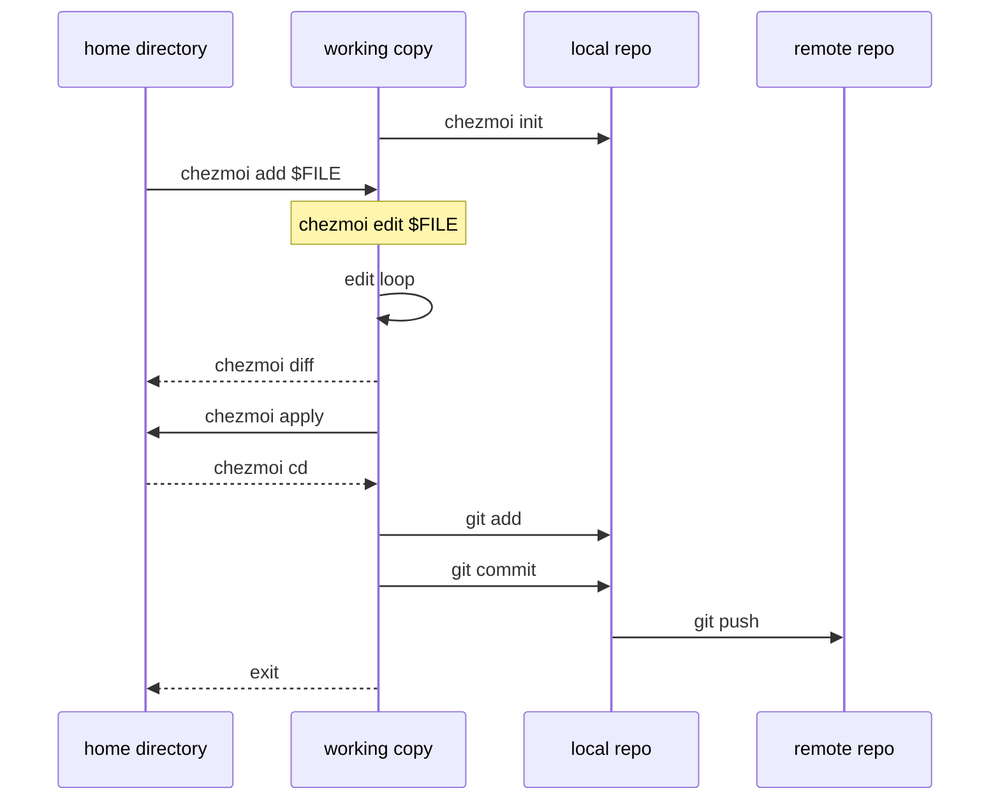

---
tags:
  - tooling
  - bootstrap
kind: resource
format: note
source:
  - "[Officail docs](https://www.chezmoi.io/)"
  - "[My GitHub Dotfiles repo](https://github.com/elecdot/dotfiles)"
aliases:
  - chezmoi
---

# chezmoi

## Focus
Practical guide to managing dotfiles with chezmoi: installation options, the source-state workflow (init/add/edit/diff/apply), and Git-based version control/sync across machines. Emphasizes safe preview-first operation with dry runs and machine-specific customization through config and templates.

## Notes

>[!tip] All chezmoi commands accept the `-v` (verbose) flag and the `-n` (dry run) flag. The combination `-n` `-v` is very useful if you want to see exactly what changes would be made

### Installation

Install via `brew`:
```bash
brew install chezmoi
```
Install via `scoop`:
```pwsh
scoop install chezmoi
```
One-line binary install (good if you do not involve any toolchain support and want `chezmoi-first` bootstrap)
```shell
sh -c "$(curl -fsLS https://get.chezmoi.io)"
sh -c "$(wget -qO- https://get.chezmoi.io)"
iex "&{$(irm 'https://get.chezmoi.io/ps1')}"
```

### Quick start

The whole metal model is shown as follow:


#### Init chezmoi

>[!todo] This will create a  new git local repository in `~/.local/share/chezmoi` where chezmoi will store its source state.

Start on you machine with:
```shell
chezmoi init
chezmoi init https://github.com/$GITHUB_USERNAME/dotfiles.git
# Private GitHub repos require other auth methods (e.g., SSH key):
chezmoi init git@github.com:$GITHUB_USERNAME/dotfiles.git
```

#### Add files with chezmoi

>[!todo] This will copy `~/.bashrc` to `~/.local/share/chezmoi/dot_bashrc` (chezmoi owned working copy)

```shell
chezmoi add ~/.bashrc
# If current `~/.bashrc` is a symlink point to a file, you may need:
#chezmoi add --follow ~/.bashrc
```

#### Edit files with chezmoi

>[!todo] chezmoi just provide a encapsulated to edit your chezmoi own working copy (basically, it support [[#template]] and [[#encrypting]]), but you don't have to use `chezmoi edit` to edit your dotfiles:
>1. Use `chezmoi cd` and edit files in the src dir. (or directly use `chezmoi edit` when your editor support edit a dir). **NOTE:** `chezmoi cd` will start a new shell at  `~/.local/share/chezmoi`, you should `exit` it when you're done.
>2. Edit file directly in your `$HOME`, and then merge your changes with source state by running `chezmoi merge $FILE`

```shell
chezmoi edit ~/.bashrc
chezmoi edit --apply ~/.bashrc# Will automatically apply your changes when exit
chezmoi edit --watch ~/.bashrc# Will automatically apply your changes when write/store
```

#### View and Apply the changes

>[!todo] You can check and apply the changes on working copy to exact `$HOME/.bashrc`

>[!caution] You may want `-v` `-n` before apply the exact changes

```shell
chezmoi diff# This will show git style diff
chezmoi -v apply# This will modify $HOME/dotfiles
# If current $HOME/dotfiles are symlink, use:
chezmoi apply --force
```

#### Version Control your dotfiles

>[!tip] You can basically treat your chezmoi repo as a normal Git repo. Tips:
>- chezmoi is designed so that your dotfiles repo can be public by making it easy for you to store your secrets either in your password manager, in encrypted files, or in private configuration files. Your dotfiles repo can still be private, if you choose.
>- A convention is to set your GitHub repo name as `dotfiles` so chezmoi can solve it as default.

#### Across machines

```shell
# Init your new machine first
chezmoi init https://github.com/$GITHUB_USERNAME/dotfiles.git
# Private GitHub repos require other auth methods (e.g., SSH key):
chezmoi init git@github.com:$GITHUB_USERNAME/dotfiles.git
# Keep your machine up-to-date from remote Git repo
chezmoi update -v
```

### Concepts

#### chezmoi's files and directories

- `~/.local/share/chezmoi` - The *source directory*: is common to all your machines, and is a clone of your dotfiles repo. Each file that chezmoi manages has a corresponding file in the source directory.
- `~/.config/chezmoi/chezmoi.toml` - The *config file*: **specific to the local machine**.

**Files whose contents are the same on all of your machines** are copied verbatim from the source directory. 

**Files which vary from machine to machine** are executed as [[#templates]], typically using data from the local machine's config file to tune the final contents specific to the local machine.

#### Crate a config file automatically

As [the documentation](https://www.chezmoi.io/user-guide/setup/#create-a-config-file-on-a-new-machine-automatically) says, a configuration file should automatically apply when you run `chezmoi init`. But seems not in fact...

## TODO

- [ ] Learn more chezmoi pro usage such as *encrypting*, *configuration* and *templates*

## Related

- [[tooling]]

## Next
- [ ] Clarify one related concept
- [ ] Link this note to a summary, reference, or follow-up note
